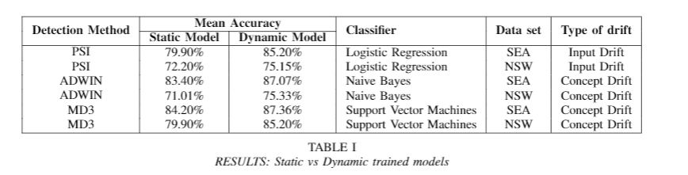

# Abstract

In the dynamic world, nothing is constant. This is especially true when it comes to data. 
Thus, it’s inevitable that the performance of many machine learning models will decline over time. This is particularly relevant for models related to human behavior that are built on old data which, over time, becomes inconsistent with the new data. This problem, known as data drift, complicates the task of learning a model from data and demands model retraining to maintain adequate performance. This paper considers different types of data drift, peculiarities of the problem, and different methods to detect and address data drift.  We also discuss various approaches to model retraining to combat data drift and give a critical review of existing approaches to the problem.

# Results 

The over-arching conclusion of all the experiments conducted is quite clear **{Dynamically trained models perform better than statically trained models when faced with any type of data set drift.** This is in-line with our initial hypothesis that data set drift affects the model's performance in production over time. The model can be trained to have high accuracy, but over time, because of non-stationary real-world data, models' performance starts to degrade. This can be mitigated by effectively detecting these drifts and triggering a model retrain when such drifts occur. 

One of the key points to note from table \ref{tab:results_table_static_dynamic} is that the gap between mean accuracy between static and dynamic models is more widened for synthetic data set. This is because the synthetic data set has clearly defined and sudden concept shifts with hard boundaries while in the real-world data set the concepts are likely more gradual.

For MD3, we found that the number of standard deviations parameter, denoted as $\theta$ in the sections earlier, was hard to tune. We started with 3 standard deviations but that wasn't sensitive enough for our drift detector to trigger any retraining. After multiple tries, 0.25 worked for synthetic data set SEA and 0.1 worked for real-world data set NSW. We speculate that these values are too small and this indicates that the changes in $\rho$ are hard to detect. We believe this is because we used the default margin setting and by making the margin wider (via changing the parameter \textbf{c} ), we can make the rho parameter more sensitive. More experimentation is required to make any claims about this idea.

Lastly, we would like to comment on the fact that not every input drift causes a deteriorating effect on accuracy of the model. As noted in figure \ref{fig:PSI_wo_intervention}, the PSI keeps increasing but model's accuracy was going up. This means that with the PSI method, we might be retraining the model unnecessarily in some cases and this can also lead to a decrease in model accuracy as well. Similar behavior was observed in case of MD3 drift detection. In cases where the drift detection is done in an unsupervised manner, the detection of drift doesn't always co-relate with decreased model performance. It appears to be a warning which may result in model degradation. To mitigate this issue, we echo the idea proposed in Sethi et al [[1]](#1) The unsupervised drift detectors alert the system of a possible drift, but before retraining the model , degradation is confirmed by obtaining actual labels 

Relying on unsupervised indicators alone isn't enough to indicate that model retraining is required. As appealing as unsupervised detectors seem, they aren't as concrete in terms of their detection as supervised detectors.

## References
<a id="1">[1]</a> 
Tegjyot Singh Sethi, Mehmed Kantardzic (2017
On the Reliable Detection of Concept Drift from Streaming Unlabeled Data 
[arXiv](https://arxiv.org/abs/1704.00023)
